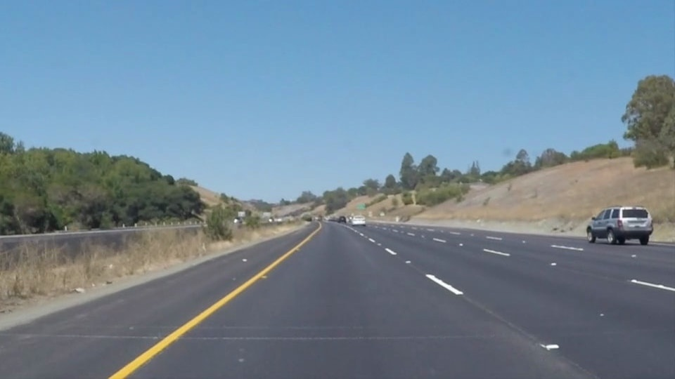
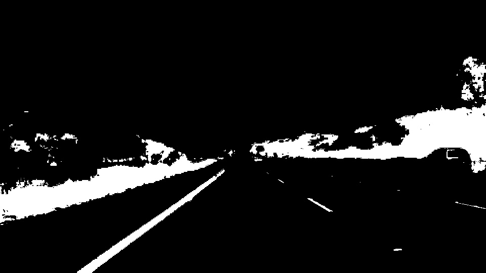
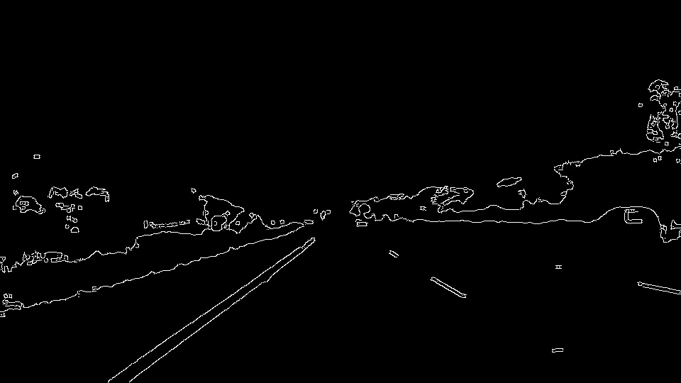
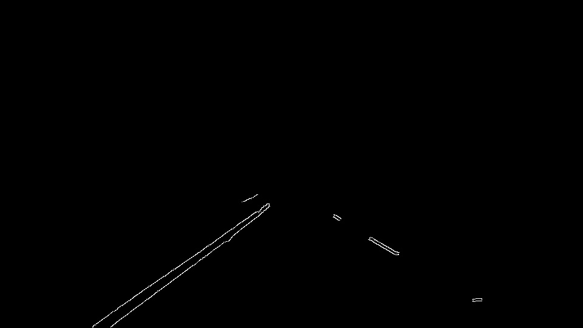
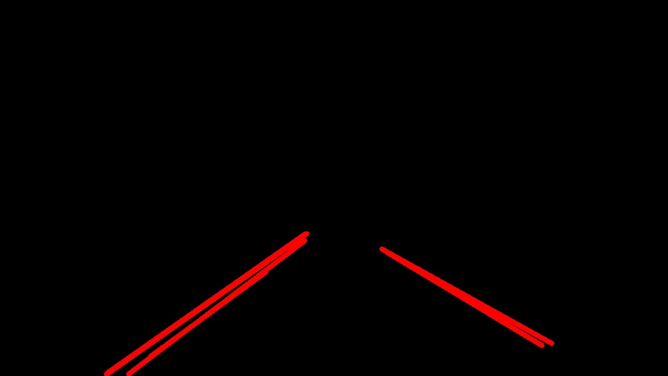
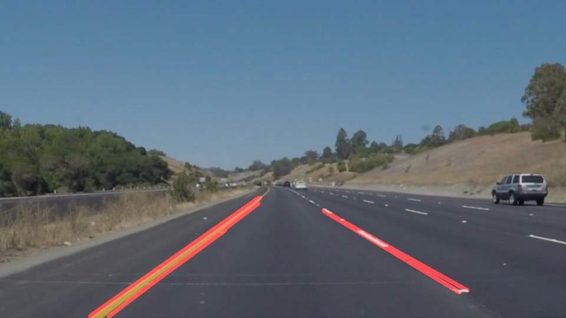

# **Finding Lane Lines on the Road** 
[](http://www.udacity.com/drive)


Overview
---

When we drive, we use our eyes to decide where to go.  The lines on the road that show us where the lanes are act as our constant reference for where to steer the vehicle.  Naturally, one of the first things we would like to do in developing a self-driving car is to automatically detect lane lines using an algorithm.

In this project you will detect lane lines in images using Python and OpenCV.  OpenCV means "Open-Source Computer Vision", which is a package that has many useful tools for analyzing images.  

---

The goals / steps of this project are the following:
* Make a pipeline that finds lane lines on the road
* Reflect on your work in a written report


---

### Reflection

### 1. Describe the pipeline.

My pipeline consisted of 6 steps. 
* 1.change the img to hsv color space<br>


* 2.modify yellow and white pixels to white and else pixels to black<br>


* 3.get the gaussian_blur img<br>


* 4.get the edge of the img<br>


* 5.clip the img<br>


* 6.get the lines<br>


* 7.get the result<br>



draw_lines():
```python
    imshape = img.shape
    
    for line in lines:
        for x1,y1,x2,y2 in line:
            
            k = (y2-y1)/(x2-x1) #slope
            b = y1 - k * x1 # Intercept

            if ( k < 0.8  and  k > 0.5 ) or \
                ( k < -0.5  and  k > -0.8  ): 
                    
                if b > imshape[0] or b < (imshape[0] / 2):
                    cv2.line(img, (x1, y1), (x2, y2), color, thickness)

```


### 2.Potential shortcomings with my pipeline.

The output lines are not completing when line segments are in the pictures


### 3. Possible improvements to my pipeline.

Use the slope and the intercept to caclulate the lane lines
